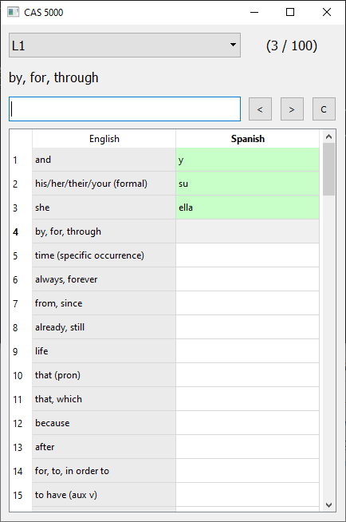

# CAS 5000

A quick and dirty GUI to help with memorizing Spanish vocabulary.

I was inspired to create this after I realized that I learnt vocabulary much faster with games on websites like [sporcle.com](https://www.sporcle.com/) and [jetpunk.com](https://www.jetpunk.com/) over apps like Duolingo. So this is a collection of **5000** Spanish nouns, verbs, adjectives, and phrases segmented into 50 levels of increasing difficulty (i.e. usage frequency). The app gives you something in English and you type the Spanish translation. It's a simple but incredibly effective method because of the tight feedback loop. Press `ENTER` to skip words, `UP` to skip backwards, and `F1` to restart the level.

